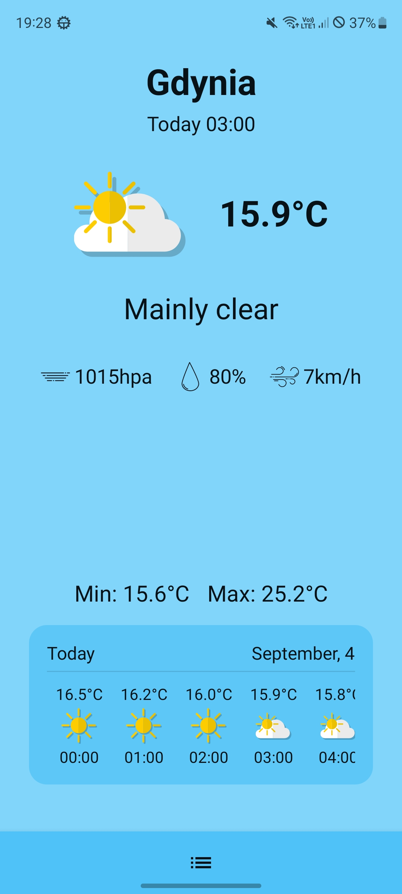
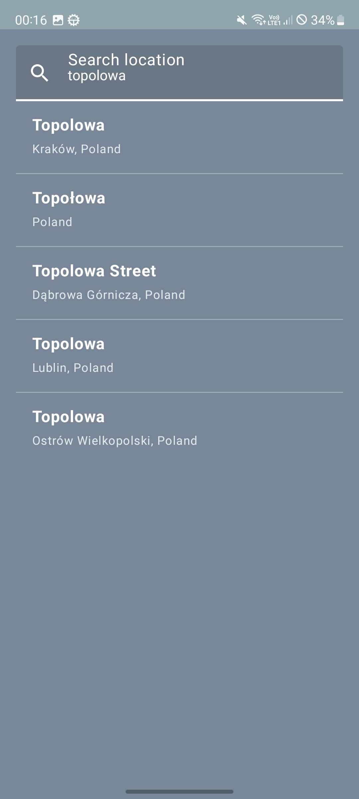
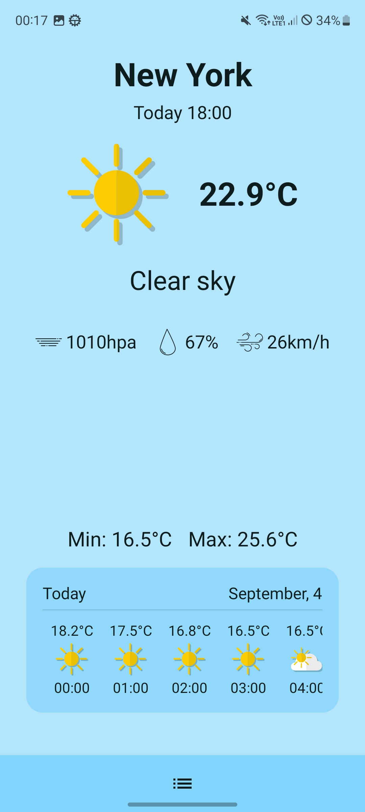
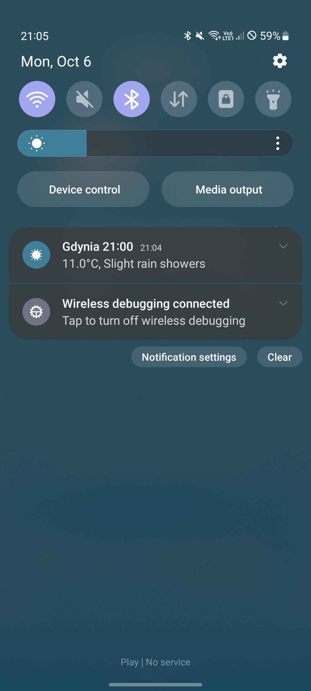

# AaronWeather
Simple kotlin android app for checking current weather  
Created to showcase my skills in Android development  

## Main Features
- Current weather by location
- Location picker with permission handling
- Weather and address data fetched from APIs
- State handling with loading animation
- Mapping DTO → domain models
- Theme adapted to the current weather
- Dependency injection with Hilt
- Pull to refresh support

## Built with
- Kotlin
- Jetpack Compose
- Jetpack Navigation
- MVVM + Repository
- Lottie Animation
- Hilt (Dependency Injection)
- Retrofit (Weather API and Places API)
- Coroutines & Flow

## Screenshots

  
  
  
  

