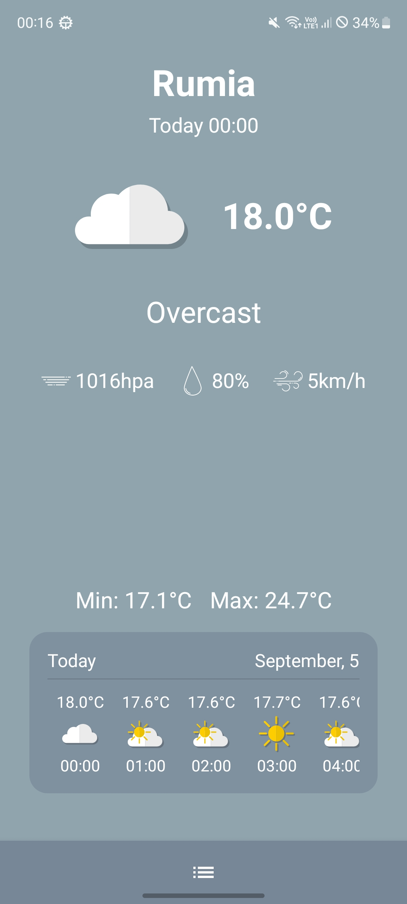

# AaronWeather

Simple kotlin android app for checking current weather  
Created to showcase my skills in Android development

## Main Features

- Current weather by location
- Location picker with permission handling
- Weather and address data fetched from APIs
- Periodic weather notifications
- State handling with loading animation
- Mapping DTO → domain models
- Theme adapted to the current weather
- Pull to refresh support
- Fully tested with unit, UI, and end-to-end tests

## Built with

- Kotlin
- Jetpack Compose
- Jetpack Navigation
- MVVM + Repository
- Lottie Animation
- Hilt (Dependency Injection)
- Retrofit (Weather API, Geocoding API and Places API)
- Coroutines & Flow
- WorkManager for background notifications
- DataStore for persistent last location storage

## Notifications

- Every 15 minutes shows a notification with the current weather for the last saved location
- Opens the app without creating a new activity instance if already open
- Handles permission checks before showing notifications

## Testing

- Unit tests: mappers, repository
- ViewModel tests: location & weather state updates
- UI tests (Compose): screens, loading, errors
- End-to-end: full weather flow with MockWebServer
- Tools: Kotlin, Compose, Hilt, MockK, Retrofit

## Download

[Download Aaron Weather APK](https://github.com/komodobear/AaronWeather-AndroidApp/releases/latest)

## Screenshots

  
  
  
  

